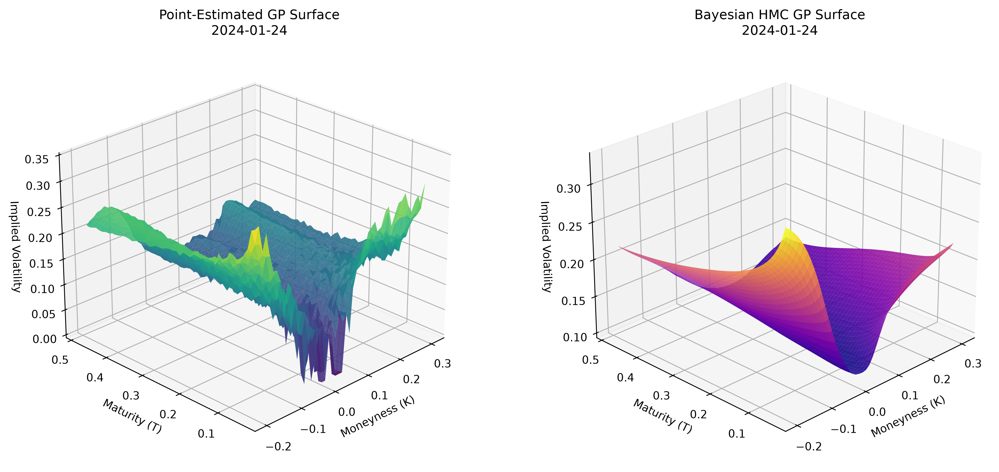

# Bayesian Gaussian Process Inference for Implied Volatility Surfaces

**Author:** Mikhail Semenov

**Degree:** M.Sc. in Mathematics

**Institution:** University of St. Andrews

**Date:** 11 August 2026

---

## 📌 Overview

This repository contains the full codebase and primary manuscript for my dissertation titled **"Bayesian Gaussian Process Inference for Implied Volatility Surfaces"**.

The project investigates the weak identifiability of the Log-Marginal Likelihood hyperparameter space of financial data using Point-Estimation and Bayesian Hamiltonian Monte Carlo models. The financial data is inherently noisy, thus proposing a challenge for deterministic models that optimise hyperparameters. On the other hand, the Bayesian approach seeks to resolve this instability by acting as a structural regulariser. Empirically, this framework has proved to be reliable during expansion and turmoil regimes (i. e., 2020 and 2024 respectively). Resulting in the elimination of 61.9% arbitrage failure rates seen in deterministic optimisation, yielding economically valid, arbitrage-free surfaces with a negligible trade-off in out-of-sample accuracy.

---

### 📈 Deterministic Optimization Breakdown vs. Bayesian HMC Regularization

Under stressed market regimes, the competition between GP data fit and complexity penalty collapses into an ill-conditioned LML plateau. Point estimation yields severely warped, non-convex local surfaces (left), whereas Bayesian HMC posterior integration restores global regularity and eliminates arbitrage pathologies (right):

<p align="center">
  
</p>

### 📊 Key Empirical Findings: Resolving Optimization Instabilities

| Metric | Point-Estimated GP (L-BFGS-B) | Bayesian HMC GP (NUTS) |
| :--- | :---: | :---: |
| **Clean Calendar Days** | **85.7% (18/21)** | 71.4% (15/21) |
| **Clean Butterfly Days** | 38.1% (8/21) | **61.9% (13/21)** |
| **Dual-Violation Days** | 14.3% (3/21) | **9.5% (2/21)** |

> **Key Takeaway:** Posterior integration resolves the flat log-marginal likelihood (LML) ridge pathology where gradient-based optimizers stall. By averaging over plausible hyperparameter configurations, HMC eliminates 61.9% of butterfly arbitrage violations and restores convexity in the strike dimension without compromising predictive accuracy.

---

## 📁 Repository Structure

```text
├── bayesian-gp-volatility-surface/         # Source code for data processing & analysis
│   ├── .gitignore
│   ├── data                                  # Folder containing MOCK data
│   ├── 01_ingest_spx.py                      # Data ingestor
│   ├── 02_preprocess.py                      # Preprocess
│   ├── 03_prior_model.py                     # Fit the parametric prior
│   ├── 04_gp_point_estimation.py             # Fit point-estimator GP
│   ├── 05_topology_scan.py                   # Topological LML Surface / Visual Diagnostic
│   ├── 06_restart_sensitivity.py             # Restart module to check the best fitting Point-Estimating GP
│   ├── 07_gp_hmc.py                          # Bayesian Inference model
│   ├── 08_compare_results.py                 # OOS RMSE Comparison
│   ├── 09_plots.py                           # Plots
│   ├── run_all.py                            # Main execution script
│   └── utils.py                              # Static Arbitrage calculations
├── main_text/                              # Main text directory
│   ├── Master's Dissertation Final.pdf       # Full text of the dissertation
│   ├── Master's Dissertation Final.tex       # Expected location for raw CBOE CSVs (Git-ignored)
│   ├── ProofsForAppendixB.pdf                # Manually derived proofs for Appendix B
│   └── Figures                               # Figures used in the main text
├── requirements.txt                        # Python packages requirements
└── README.md                               # Project documentation

```

---

## 🔒 Data Availability & Licensing Notice

> **Note on Proprietary Data:**
> The raw option datasets used in this study are proprietary to the **Chicago Board Options Exchange (CBOE)** and cannot be redistributed under licensing restrictions.

To ensure code reproducibility, a **mock dataset** is included. This synthetic data adheres to the exact schema, data types, and column structures required by the pipeline.

---

## 🚀 Getting Started & Execution

### 1. Prerequisites

Ensure you have **Python 3.x** installed. Install the required packages via:

```bash
pip install -r code/requirements.txt

```

### 2. Running with Mock Data (For Pipeline Verification)

To test the pipeline end-to-end using synthetic data:

```bash
# Run the primary analysis pipeline
python run_all.py

```

### 3. Running with Raw CBOE Data (If Licensed Access Available)

If you hold an institutional license or valid access to raw CBOE data:

1. Place the data files inside 'Masters-Dissertation-Project/bayesian-gp-volatility-surface/data/' folder without changing the name. 
2. Add the date to run_pipeline() function inside run_all.py.
3. Run the main pipeline pointing to the raw directory:

```bash
python code/main.py --data_path data/raw/

```

---

## 📄 Manuscript

The complete text, including full empirical results, methodologies, figures, and references, is available in **[`Bayesian Gaussian Process Hyperparameter Inference for Implied Volatility Surfaces.pdf`](https://github.com/mishavelial/Masters-Dissertation-Project/blob/main/main_text/Master's%20Dissertation%20Final.pdf)**.

---

## 📬 Contact

If you have questions regarding the methodology or execution, feel free to reach out:

* **Author:** [Mikhail Semenov]
* **Email:** [ms624@st-andrews.ac.uk]
